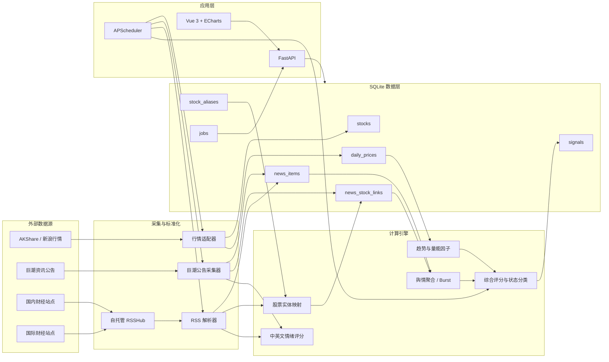
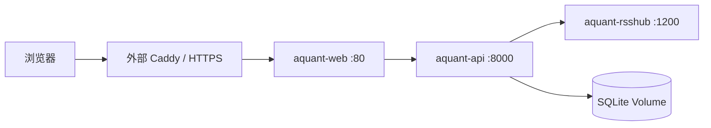
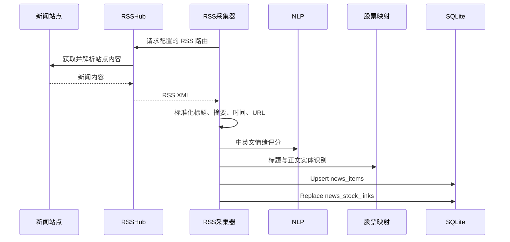

# A-Quant Insight 系统架构与实现逻辑

> 文档版本：V1.2  
> 对应代码：`main` 分支  
> 系统定位：A 股趋势、量能、公告与国内外新闻融合的轻量量化研究系统

## 1. 系统概览

A-Quant Insight 当前实现了一条完整的研究链路：

```text
A 股行情 ───────────────┐
                       ├─→ 趋势/量能因子 ─┐
巨潮公告 ─→ NLP ───────┤                  │
                       ├─→ 舆情因子 ──────┼─→ 综合信号 ─→ FastAPI ─→ Vue Web
国内外新闻 → RSSHub ───┤                  │
                       └─→ 股票实体映射 ──┘
```

系统并不执行交易，也不提供投资建议。它负责：

1. 自动构建活跃 A 股股票池；
2. 更新日线行情；
3. 获取巨潮公告和国内外财经新闻；
4. 将非结构化文本映射到股票；
5. 计算趋势、量能、情绪和热度；
6. 生成可解释的综合评分与状态标签；
7. 通过 Web 页面展示研究结果。

## 2. 总体架构



## 3. 部署拓扑

生产环境使用 Docker Compose，包含三个应用容器：

| 容器 | 职责 | 内部端口 | 公网暴露 |
| --- | --- | --- | --- |
| `aquant-api` | FastAPI、调度、采集、因子计算 | `8000` | 否 |
| `aquant-rsshub` | 将国内外站点转换为 RSS | `1200` | 否 |
| `aquant-web` | Vue 静态页面与 Nginx API 代理 | `80` | 通过外部反向代理 |



设计原则：

- API、RSSHub 不直接开放公网端口；
- Web 容器加入外部反向代理网络；
- SQLite 文件存放在 Docker Volume；
- 容器设置自动重启；
- API 和 Web 均配置健康检查；
- RSSHub 单源故障不会导致整个新闻任务失败。

## 4. 代码目录

```text
AStock/
├── backend/
│   ├── app/
│   │   ├── main.py                 # 应用生命周期和调度
│   │   ├── api.py                  # REST API
│   │   ├── config.py               # 环境配置
│   │   ├── db.py                   # SQLite Schema 与数据访问
│   │   └── services/
│   │       ├── market.py           # AKShare 行情采集
│   │       ├── announcements.py    # 巨潮公告采集
│   │       ├── rss_news.py         # RSSHub 新闻采集
│   │       ├── news_mapping.py     # 新闻到股票映射
│   │       ├── sentiment.py        # NLP 与舆情聚合
│   │       ├── trend.py            # 趋势与量能因子
│   │       ├── scoring.py          # 综合评分和分类
│   │       └── pipeline.py         # 全股票信号计算
│   └── tests/
├── frontend/
│   └── src/
│       ├── views/Dashboard.vue     # 信号榜单
│       ├── views/StockDetail.vue   # 个股详情
│       └── components/PriceChart.vue
├── docker-compose.yml
└── docs/SYSTEM_ARCHITECTURE.md
```

## 5. 数据模型

### 5.1 股票与行情

#### `stocks`

| 字段 | 说明 |
| --- | --- |
| `symbol` | 六位股票代码，主键 |
| `name` | 股票简称 |
| `industry` | 行业；当前行情源未补充时为“未分类” |
| `updated_at` | 基础信息更新时间 |

#### `daily_prices`

主键为 `(symbol, trade_date)`，保存开、高、低、收和成交量。

### 5.2 统一新闻数据层

#### `news_items`

一行代表一篇独立新闻或公告，与股票关系解耦。

| 字段 | 说明 |
| --- | --- |
| `id` | 新闻唯一 ID |
| `source` | 巨潮、财联社、Bloomberg 等 |
| `source_type` | `announcement`、`rss` 或 `legacy` |
| `language` | `zh` 或 `en` |
| `region` | `CN` 或 `GLOBAL` |
| `published_at` | 发布时间 |
| `title` / `summary` | 标题与摘要 |
| `url` | 原文链接 |
| `sentiment` | `[-1, 1]` 情绪分 |
| `keywords` | 命中的情绪关键词 |
| `raw_payload` | 来源路由、GUID 等追溯信息 |

RSS 新闻的 ID 优先由原文 URL 的 SHA-256 生成，可跨不同 RSS 路由去重。

#### `news_stock_links`

一篇新闻可以映射到多只股票：

| 字段 | 说明 |
| --- | --- |
| `news_id` | 新闻 ID |
| `symbol` | 股票代码 |
| `confidence` | 映射置信度 |
| `match_type` | 代码、标题别名或正文别名匹配 |

只有建立了该关联的新闻才会进入对应股票的舆情因子。

#### `stock_aliases`

保存股票简称、去后缀名称和人工维护的英文别名。

当前英文别名示例包括：

- CATL → 宁德时代；
- BYD → 比亚迪；
- SMIC → 中芯国际；
- Kweichow Moutai / Moutai → 贵州茅台。

#### 兼容表 `news`

早期版本将新闻与股票关系放在同一张表。当前该表仅作为巨潮公告兼容写入和自动迁移来源，新业务查询使用 `news_items` 与 `news_stock_links`。

### 5.3 信号与任务

#### `signals`

主键为 `(symbol, signal_date)`，保存趋势、舆情、量能和综合评分，以及 JSON 格式的完整指标快照。

#### `jobs`

保存行情、巨潮、RSS 和信号任务的状态、进度、错误摘要与运行时间。`GET /api/jobs` 可直接读取。

## 6. 行情链路

### 6.1 股票池

默认使用 AKShare 新浪行情源：

1. 获取沪深京实时股票列表；
2. 按成交额降序排列；
3. 选择前 500 只活跃股票；
4. `AKSHARE_UNIVERSE_SIZE=0` 时不限制数量。

选择活跃股票池是免费数据源稳定性、计算耗时和个人研究需求之间的折中。

### 6.2 日线更新

行情使用前复权数据：

```text
股票列表 → 并发抓取日线 → 字段标准化 → SQLite Upsert
```

实现细节：

- 默认历史窗口 500 个自然日；
- 首次获取完整窗口；
- 后续任务回刷最近 30 天；
- 每只股票最多重试三次；
- 默认三个并发线程；
- 每完成十只股票更新一次任务状态。

回刷而非纯追加是因为前复权价格可能在分红送转后发生历史调整。

## 7. 巨潮公告链路

```text
巨潮全市场公告
  → 按日期批量获取
  → 过滤到当前股票池
  → 公告 ID + 股票代码去重
  → 标题情绪评分
  → news_items
  → news_stock_links
```

公告天然带证券代码，因此映射置信度为 `1.0`。同一公告关联多只股票时，每只股票分别建立关联。

首次默认回补最近七天；后续从数据库最新公告时间向前回退一天重新获取，以容纳延迟发布和修订。

## 8. RSSHub 新闻链路

### 8.1 默认来源

国内：

- 财联社电报；
- 华尔街见闻股市；
- 华尔街见闻公司；
- 36 氪快讯。

国际：

- Bloomberg Markets；
- Bloomberg Business；
- Al Jazeera Economy。

源列表由 `RSS_FEEDS_JSON` 覆盖，因此新增源不需要修改采集代码。

### 8.2 处理流程



每个源独立捕获异常。任务整体状态规则：

- 至少一个源成功：`completed`；
- 全部源失败：`failed`；
- 失败源和错误摘要记录到 `jobs.details`。

## 9. 股票映射逻辑

映射按置信度从高到低执行。

### 9.1 六位代码

文本中出现有效六位 A 股代码时，直接映射，置信度 `1.0`。

### 9.2 中文标题

- 股票完整简称命中标题时映射；
- 短简称需要出现在标题开头，并紧跟冒号、空格或括号；
- 标题匹配使用原始别名置信度。

示例：

```text
“贵州茅台：年度权益分派公告” → 600519
```

### 9.3 中文正文

正文只接受至少五个字符的中文别名，并将置信度乘以 `0.8`，减少普通词误报。

### 9.4 英文别名

英文采用单词边界匹配，避免部分字符串误命中。

### 9.5 通用简称屏蔽

“机器人”等既是股票简称又是普通行业词的名称进入黑名单，不参与自动别名匹配。需要关联时应依赖股票代码或更明确的公司名称。

每次重新采集同一批 RSS 新闻时，会先删除旧股票关联再写入新关联，因此映射规则升级后可自动清除历史误报。

## 10. NLP 情绪模型

当前模型是可解释的中英文金融关键词模型，不是 Transformer 或大语言模型。

### 10.1 单篇文本评分

```math
Sentiment(text) =
\operatorname{clip}\left(
\frac{\sum weight(keyword)}{N_{keywords}},
-1, 1
\right)
```

处理内容为：

```text
标题 + 摘要
```

规则包括：

- 中文正负面金融词；
- 英文正负面金融词；
- 分句内否定识别，例如“未被处罚”不判为利空；
- 语义例外，例如“回购注销限制性股票”不因为“回购”判为利好。

### 10.2 当前限制

- 无上下文深度理解；
- 无讽刺、比较关系和事件主体识别；
- 英文别名覆盖有限；
- 新闻影响方向未区分公司自身、供应商和竞争对手；
- 情绪分没有通过历史收益监督训练。

后续可在统一新闻层之上替换为 FinBERT、中文金融模型或 LLM 分类器，而不改变下游数据结构。

## 11. 舆情因子

信号日期使用最新行情交易日，而不是服务器当天日期。

### 11.1 当日情绪

若信号日存在关联新闻：

```math
S = mean(sentiment_i)
```

若信号日没有新闻，则使用最近十条关联新闻的平均值。

### 11.2 热度 Burst

```math
Burst =
\frac{mentions_{signal\_date}}
{\max(avg(mentions_{previous\ 5\ calendar\ days}), 1)}
```

当前按自然日计算前五天，并使用最小基线 `1` 防止除零。

### 11.3 关键词

统计参与本次情绪计算的新闻关键词频次，返回前五个关键词用于 Web 解释。

## 12. 趋势与量能因子

每只股票至少需要 60 个交易日数据。

### 12.1 基础指标

- MA5；
- MA20；
- MA60；
- 20 日收盘价归一化斜率；
- MA60 最近 20 个有效点归一化斜率；
- 20 日动量；
- 当日成交量 / 20 日平均成交量。

### 12.2 多头条件

```text
MA5 > MA20 > MA60
且 20 日价格斜率 > 0
且 收盘价 > MA60
```

### 12.3 趋势分

```math
TrendScore = 100 \times
(0.45 \times Structure
+ 0.35 \times Slope
+ 0.20 \times Momentum)
```

其中：

- `Structure`：满足均线多头排列时为 `1`，否则为 `0`；
- `Slope`：20 日归一化斜率缩放并限制到 `[0,1]`；
- `Momentum`：20 日涨跌幅映射到 `[0,1]`。

### 12.4 量能分

```math
VolumeScore =
\operatorname{clip}\left(
\frac{VolumeRatio}{2} \times 100,
0, 100
\right)
```

量比达到 `2` 时量能得分封顶。

## 13. 综合评分和状态

### 13.1 情绪标准化

```math
SentimentScore = (Sentiment + 1) \times 50
```

将 `[-1,1]` 映射为 `[0,100]`。

### 13.2 综合评分

```math
TotalScore =
0.5 \times TrendScore
+ 0.3 \times SentimentScore
+ 0.2 \times VolumeScore
```

当前权重为固定配置，尚未通过回测训练。

### 13.3 状态分类

| 条件 | 状态 |
| --- | --- |
| 多头趋势、情绪 ≥ 0.35、Burst ≥ 3 | 主升浪信号 |
| 多头趋势 | 趋势股 |
| 非多头且 Burst ≥ 3 | 风险博弈 |
| 非多头且情绪 ≤ -0.35 | 回避 |
| 其他 | 观察 |

## 14. 调度逻辑

时区固定为 `Asia/Shanghai`。

| 任务 | 默认时间 | 说明 |
| --- | --- | --- |
| 行情更新 | 每日 16:05 | 更新股票池和前复权日线 |
| 日间信号 | 每日 16:30 | 使用最新行情计算信号 |
| RSS 新闻 | 每小时 `:15` | 更新国内外新闻 |
| RSS 后重算 | 每小时 `:25` | 新闻更新后重算信号 |
| 巨潮公告 | 每日 20:30 | 获取公告增量 |
| 公告后重算 | 每日 20:45 | 公告更新后重算信号 |

所有任务 `max_instances=1`，避免同一任务并发重入。

首次启动时：

- 如果启用演示模式，写入确定性演示数据；
- 如果生产库没有行情，后台线程依次执行行情、巨潮、RSS 和信号初始化；
- 如果已有行情，则不自动进行全量初始化。

## 15. API

| 方法 | 路径 | 说明 |
| --- | --- | --- |
| `GET` | `/api/health` | 服务、行情、新闻数量和行情任务状态 |
| `GET` | `/api/jobs` | 所有后台任务状态 |
| `GET` | `/api/dashboard` | 最新信号榜单和汇总 |
| `GET` | `/api/stocks/{symbol}` | 个股、120 日行情、50 条信息流和最新信号 |
| `POST` | `/api/pipeline/run` | 手工重算信号 |
| `GET` | `/docs` | FastAPI OpenAPI 文档 |

## 16. Web 实现

前端使用 Vue 3、Vue Router 和 ECharts。

### Dashboard

- 最新信号日；
- 覆盖标的、趋势成立、舆情异动和平均分；
- 综合分排序；
- 状态筛选；
- 趋势、情绪、Burst 和关键词摘要。

### 个股详情

- 120 日收盘价；
- MA20、MA60；
- 趋势、舆情和量能评分；
- MA5 / MA20 / MA60、动量、量比和 Burst；
- 巨潮公告与 RSS 新闻统一时间线；
- 来源、摘要、情绪、关键词和原文跳转。

## 17. 可观测性与容错

已实现：

- 行情单股重试；
- RSS 单源故障隔离；
- SQLite WAL；
- 数据 Upsert；
- 新闻 URL 去重；
- 任务进度和错误摘要；
- Docker 健康检查；
- 容器自动重启；
- 关键业务单元与 API 测试。

尚未实现：

- Prometheus / Grafana；
- 日志集中收集；
- 失败告警；
- 数据完整性自动校验；
- 任务分布式锁；
- 数据库备份自动化；
- API 身份认证和限流。

## 18. 当前生产规模

当前配置基线：

- 活跃 A 股股票池：500 只；
- 日线历史：约 500 个自然日窗口；
- 巨潮公告首次回补：7 天；
- RSSHub 默认源：7 个；
- RSS 更新频率：每小时；
- SQLite 单机存储；
- 单机 Docker Compose 部署。

实际记录数会随时间和来源可用性变化，不在代码文档中写死。

## 19. 关键配置

| 变量 | 默认值 | 说明 |
| --- | --- | --- |
| `AKSHARE_SOURCE` | `sina` | 行情源 |
| `AKSHARE_UNIVERSE_SIZE` | `500` | 股票池大小 |
| `AKSHARE_HISTORY_DAYS` | `500` | 历史窗口 |
| `AKSHARE_WORKERS` | `3` | 行情并发 |
| `NEWS_HISTORY_DAYS` | `7` | 巨潮首次回补 |
| `RSSHUB_BASE_URL` | `http://rsshub:1200` | RSSHub 内部地址 |
| `RSS_UPDATE_MINUTE` | `15` | 每小时 RSS 更新时间 |
| `RSS_FEEDS_JSON` | 内置源列表 | 自定义 RSSHub 路由 |
| `DEMO_DATA` | `false` | 是否使用演示数据 |
| `ENABLE_SCHEDULER` | `true` | 是否启用调度 |

## 20. 已知技术债

1. `news` 旧表仍存在，巨潮采集同时写新旧表；
2. 行业字段尚未从稳定数据源补全；
3. 新闻词典 NLP 能力有限；
4. 股票英文别名需要持续维护；
5. Burst 当前按自然日而非交易日序列计算；
6. 信号计算逐股票读取 SQLite，可进一步向量化；
7. 每小时所有股票重算，在股票池扩大后应改为增量计算；
8. `POST /api/pipeline/run` 暂无鉴权；
9. SQLite 适合当前单机规模，但不适合多实例并发写入；
10. 尚无回测和收益验证，评分权重仍是产品假设。

## 21. 推荐演进路线

### 近期

1. 移除旧 `news` 表，完成统一数据层迁移；
2. 增加行业分类和行业中性化；
3. 增加新闻来源权重、时间衰减和映射审核页面；
4. 将 Burst 改为交易日序列；
5. 添加任务失败通知和数据库备份。

### 中期

1. 引入中文金融情绪模型和 FinBERT；
2. 保存 NLP 模型版本与推理证据；
3. 构建历史回测、交易成本和涨跌停约束；
4. 计算因子 IC、分层收益、Sharpe 和最大回撤；
5. 将 SQLite 升级为 PostgreSQL，行情冷数据使用 Parquet。

### 长期

1. 行业轮动与组合优化；
2. 实盘信号推送；
3. 多策略管理；
4. 可审计的模型和数据血缘；
5. 实盘与研究环境隔离。

## 22. 风险声明

- 免费数据源可能变更、限流或短期不可用；
- 新闻标题情绪不能等同于未来股价方向；
- 股票映射可能存在漏报或误报；
- 前复权历史会因公司行为发生调整；
- 系统当前没有回测证明综合评分具有超额收益；
- 所有结果仅用于研究和工程验证，不构成投资建议。

